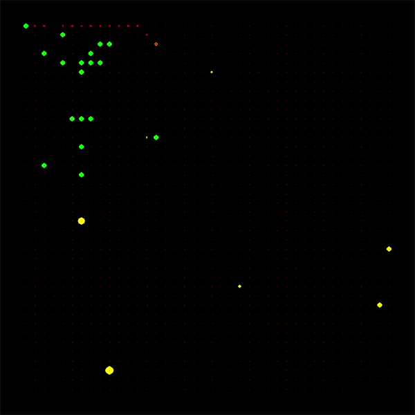

# Multi-Agent-Robots

Visualization of drones operating in an urban airspace

## Description:
Multi-agent system approach to optimize robot search.

## Setup:
A set of robots search for mineral in an unexplored
environment and return to the mothership to deposit the mineral samples obtained. In the path returning to the
mothership, the robots deposit crumbs, so that subsequent robots can identigy which path leads to a successful mineral source.
